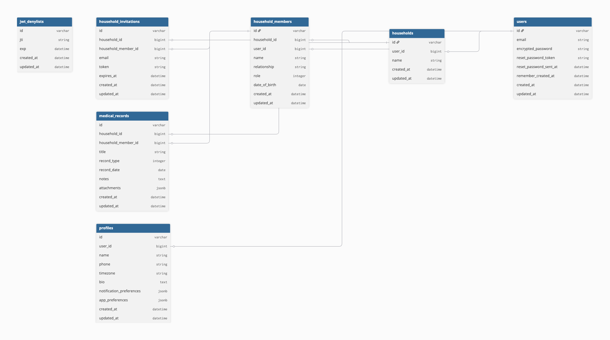

# Familia API - Domain Model

## Overview

This document defines the core domain model for the Familia API, a family household management system focused on medical record tracking.

## Core Principles

1. **User** = Authentication only (Devise)
2. **Profile** = User's personal data
3. **Household** = Central organizing unit for families
4. **HouseholdMember** = People in the household (linked or unlinked to Users)
5. **MedicalRecord** = Medical information for household members

## Entity Relationship Diagram

```
User (1) ──── has_one ──── (1) Profile
  │
  ├── has_many :owned_households (as creator)
  │
  └── has_many :household_members
           │
           └── has_many :households (through household_members)

Household
  │
  ├── belongs_to :user (creator/owner)
  ├── has_many :household_members
  ├── has_many :medical_records
  └── has_many :invitations

HouseholdMember
  │
  ├── belongs_to :household
  ├── belongs_to :user (optional - nil for unregistered)
  └── has_many :medical_records

MedicalRecord
  │
  ├── belongs_to :household
  └── belongs_to :household_member

HouseholdInvitation (temporary)
  │
  ├── belongs_to :household
  └── belongs_to :household_member
```

https://dbdocs.io/patrickminerovalencia/household_management_api?view=table_structure



## Models

### User (Authentication)

**Purpose:** Authentication and account management via Devise

**Attributes:**

- `email` (string, unique, required)
- `encrypted_password` (string, required)
- `reset_password_token` (string, unique)
- `reset_password_sent_at` (datetime)
- `remember_created_at` (datetime)
- `created_at`, `updated_at`

**Associations:**

- `has_one :profile, dependent: :destroy`
- `has_many :owned_households, class_name: 'Household', foreign_key: :user_id, dependent: :destroy`
- `has_many :household_members, dependent: :nullify`
- `has_many :households, through: :household_members`

**Validations:**

- Email format, presence, uniqueness
- Password presence, minimum length (6)

---

### Profile (User Data)

**Purpose:** Store user's personal information

**Attributes:**

- `user_id` (references users, unique, required)
- `name` (string, required)
- `phone` (string, optional)
- `timezone` (string, default: "UTC")
- `bio` (text, optional)
- `notification_preferences` (jsonb, default: {})
- `app_preferences` (jsonb, default: {})
- `created_at`, `updated_at`

**Associations:**

- `belongs_to :user`

**Validations:**

- Name presence
- Timezone in ActiveSupport::TimeZone list
- Phone format: `/\A[+]?[0-9\s()-]+\z/`

---

### Household

**Purpose:** Central organizing unit for a family or group

**Attributes:**

- `user_id` (references users, required) - creator/owner
- `name` (string, required)
- `created_at`, `updated_at`

**Associations:**

- `belongs_to :user` (creator/owner)
- `has_many :household_members, dependent: :destroy`
- `has_many :medical_records, dependent: :destroy`
- `has_many :invitations, class_name: 'HouseholdInvitation', dependent: :destroy`

**Validations:**

- Name presence
- User presence

**Business Rules:**

- Creator automatically becomes admin household_member
- Deleting household deletes all members, records, invitations

---

### HouseholdMember

**Purpose:** Represents a person in the household (registered or unregistered)

**Attributes:**

- `household_id` (references households, required)
- `user_id` (references users, optional) - nil until user accepts invite
- `name` (string, required)
- `relationship` (string, required) - "self", "spouse", "child", "parent", "other"
- `role` (enum, required) - "admin" or "member"
- `date_of_birth` (date, optional)
- `created_at`, `updated_at`

**Associations:**

- `belongs_to :household`
- `belongs_to :user, optional: true`
- `has_many :medical_records, dependent: :destroy`
- `has_one :invitation, class_name: 'HouseholdInvitation', dependent: :destroy`

**Validations:**

- Name presence
- Relationship presence, inclusion in allowed values
- Role presence, inclusion in ['admin', 'member']
- Household presence

**Business Rules:**

- `user_id` is nil for unregistered members
- Once user accepts invitation, `user_id` is set
- Role determines permissions within household
- At least one admin required per household

---

### MedicalRecord

**Purpose:** Store medical information for household members

**Attributes:**

- `household_id` (references households, required)
- `household_member_id` (references household_members, required)
- `title` (string, required)
- `record_type` (enum, required) - "lab_result", "prescription", "visit_note", "vaccination", "imaging", "other"
- `record_date` (date, optional)
- `notes` (text, encrypted)
- `attachments` (jsonb, default: []) - Array of Cloudinary URLs
- `created_at`, `updated_at`

**Associations:**

- `belongs_to :household`
- `belongs_to :household_member`

**Validations:**

- Title presence
- Record type presence, inclusion in allowed values
- Household presence
- Household member presence

**Security:**

- Notes are encrypted using Rails 7 `encrypts`
- Files stored in Cloudinary (never locally)

---

### HouseholdInvitation (Temporary)

**Purpose:** Invite unregistered users to link their account to a household member

**Attributes:**

- `household_id` (references households, required)
- `household_member_id` (references household_members, required)
- `email` (string, required)
- `token` (string, unique, required)
- `expires_at` (datetime, required)
- `created_at`, `updated_at`

**Associations:**

- `belongs_to :household`
- `belongs_to :household_member`

**Validations:**

- Email format, presence
- Token presence, uniqueness
- Expires_at presence

**Business Rules:**

- Token is generated on creation (SecureRandom.hex)
- Default expiration: 7 days from creation
- Destroyed after user accepts invitation
- Can be resent (generates new token)

---

## User Flows

### 1. User Signup

```ruby
# User signs up
user = User.create!(email: "john@example.com", password: "password123")
profile = Profile.create!(user: user, name: "John Doe")

# Auto-create household and admin member
household = Household.create!(user: user, name: "#{profile.name}'s Household")
HouseholdMember.create!(
  household: household,
  user: user,
  name: profile.name,
  relationship: "self",
  role: "admin"
)
```

### 2. Admin Adds Unregistered Family Member

```ruby
# Admin adds child who doesn't have account
member = HouseholdMember.create!(
  household: my_household,
  user_id: nil,
  name: "Sarah Doe",
  relationship: "child",
  role: "member",
  date_of_birth: Date.new(2015, 3, 15)
)
```

### 3. Admin Invites Family Member

```ruby
# Create invitation for existing member
invitation = HouseholdInvitation.create!(
  household: my_household,
  household_member: member,
  email: "sarah@example.com",
  token: SecureRandom.hex(32),
  expires_at: 7.days.from_now
)

# Send email with invite link
InvitationMailer.invite(invitation).deliver_later
```

### 4. User Accepts Invitation

```ruby
# User signs up or logs in with invite token
invitation = HouseholdInvitation.find_by!(token: params[:token])

# Link user to household member
invitation.household_member.update!(user_id: current_user.id)

# Destroy invitation
invitation.destroy!

# Now user has access to household
```

### 5. Add Medical Record

```ruby
# Admin or member adds medical record
record = MedicalRecord.create!(
  household: my_household,
  household_member: member,
  title: "Annual Checkup",
  record_type: "visit_note",
  record_date: Date.today,
  notes: "All vitals normal. Next visit in 1 year.",
  attachments: [
    { url: "https://cloudinary.../lab_results.pdf", filename: "lab_results.pdf" }
  ]
)
```

## Authorization Rules (Pundit)

### Household Access

- User can access household if:
  - They created it (owner), OR
  - They are linked as a household_member (user_id present)

### Household Member Permissions

- **Admin** can:
  - Add/edit/delete household members
  - Add/edit/delete medical records for any member
  - Invite new users
  - Delete household
- **Member** can:
  - View all household members
  - Add/edit/delete medical records for any member
  - View invitations (cannot create/delete)

### Medical Record Permissions

- User can access medical record if:
  - They have access to the household (via household_member)
  - Admin/Member roles have same permissions for MVP

## Database Indexes

```ruby
# households
- user_id

# household_members
- household_id
- user_id
- [household_id, user_id] (unique, where user_id is not null)

# medical_records
- household_id
- household_member_id

# household_invitations
- household_id
- household_member_id (unique)
- token (unique)
- email
```

## Future Enhancements

- [ ] More granular roles (viewer, editor, etc.)
- [ ] Multi-household support for same user
- [ ] Household member claiming (match by email before signup)
- [ ] Medical record templates
- [ ] Medication tracking
- [ ] Appointment scheduling
- [ ] Document OCR for uploaded files
- [ ] Activity/audit log
